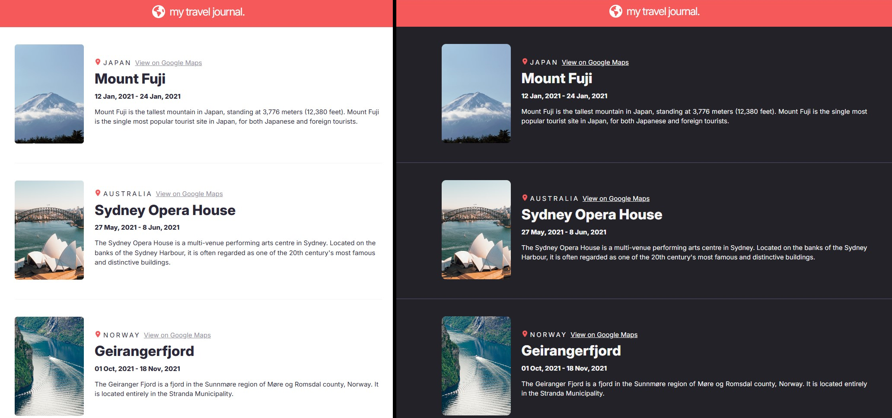
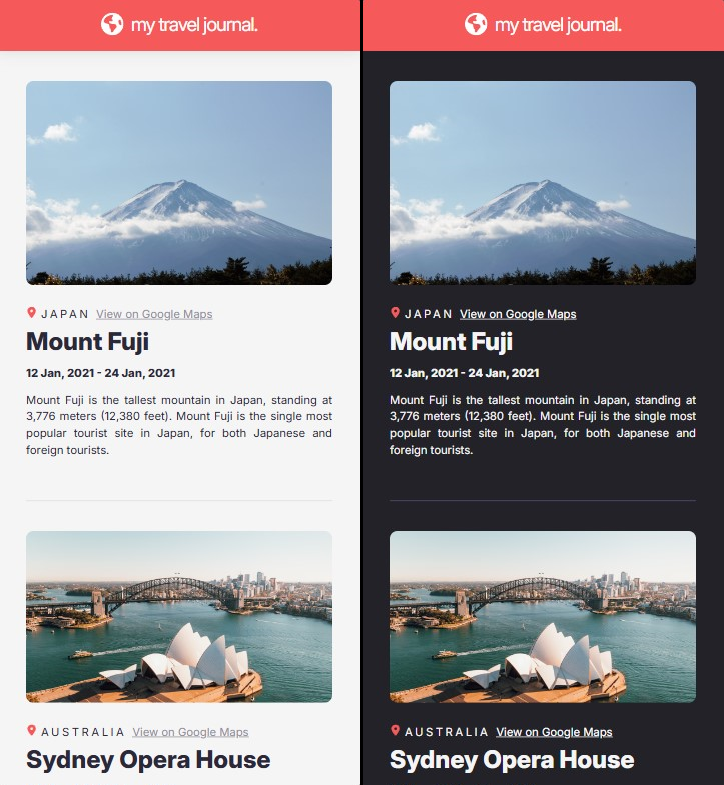

# Scrimba - Travel Journal solution
This is a solution to the Travel Journal project on [Scrimba](https://v2.scrimba.com/learn-react-c0e).

## Table of contents

- [Overview](#overview)
  - [Requirements](#requirements)
  - [Screenshot](#screenshot)
  - [Links](#links)
  - [Getting Started with Create React App](#getting-started-with-create-react-app)
- [My process](#my-process)
  - [Technologies used](#technologies-used)
  - [What I Learnt](#what-i-learnt)
- [Author](#author)

## Overview

### Requirements

<ul>
  <li>Data array in a separate  file </li>
  <ul>
    <li>Title, location, Google Maps, link, start date, end date, description, image URL</li>
  </ul>
  <li>Use <code>.map()</code> and props</li>
  <li>Style & polished</li>
  <li>Responsive</li>
</ul>

### Screenshot
- Project view on a desktop device.


- Responsive design on a mobile device.


### Links
- Live Site: [@Netlify](https://traveljournal-jmvilla12.netlify.app/)
- Source Code: [@Github](https://github.com/jmvilla12/travel-journal)

### Getting Started with Create React App
This project was bootstrapped with [Create React App](https://github.com/facebook/create-react-app).

## My process

### Technologies used

- HTML5
- CSS
- React.JS
- Flexbox

### What I Learnt

- Display a dynamic card divider, it's a better practice to implement it with css instead of js:
```css
/* Dynamic cards divider  */
/* I saw this on internet and modified it to implement it better on my code */
.cards-list > .card + .card {
    padding-top: 2rem;
    border-top: 1.5px solid var(--color-horizontal-line);
}

.cards-list .card:first-child {
    padding-top: 0;
}

.cards-list .card:last-child {
    padding-bottom: 0;
}
```

- Design patterns to implement Dark and Light mode:
```css
/* This practice helps me to create better design patterns. */

:root {
    --color-base: #F55A5A;
    --color-base-contrast: #FFFFFF;
}

/* Light mode */
@media (prefers-color-scheme: light) {
    :root {
        --color-background: #F5F5F5;
        --color-text: #2B283A;
        --color-text-highlight: #918E9B;
        --color-horizontal-line: #918E9B;
    }
}

/* Dark mode */
@media (prefers-color-scheme: dark) {
    :root {
        --color-background: #242229;
        --color-text: #F5F5F5;
        --color-text-highlight: #FFFFFF;
        --color-horizontal-line: #565074;
    }
}
```

## Author
Jose Manuel Villa 
